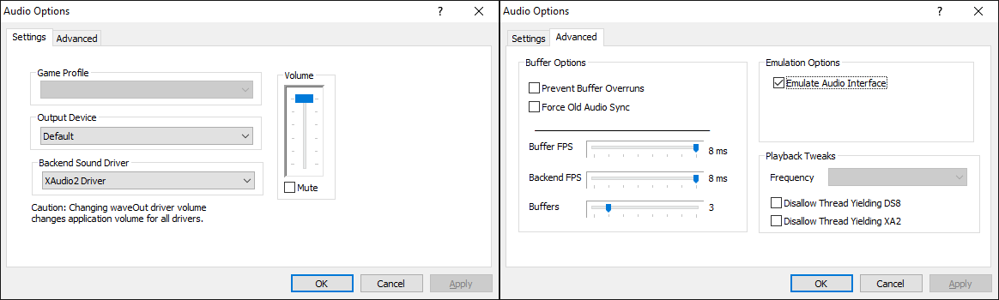

# Azimer’s HLE v0.70 WIP 10

[!file Download (manual setup only)](https://www.mediafire.com/file/s1fil36hivy7qbj/AziAudio.dll/file)

The best audio plugin available for Project64. This is a patched version, which comes with saner defaults and saves the configuration in AppData.

[!ref Return to plugin selection](plugin_setup.md#plugin-selection)
