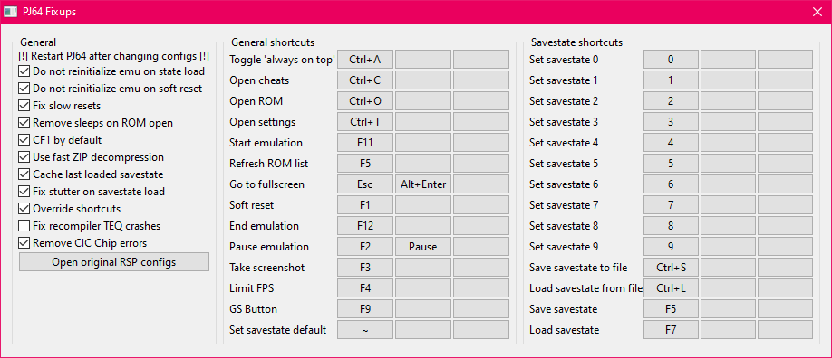

# PJ64 Fixups

[!ref target="blank" text="Download (manual setup only)"](https://github.com/aglab2/PJ64Fixups/releases)

This is an RSP plugin made by aglab2, which fixes multiple issues with the 1.6 version of Project64, while adding several new features.

Non-exhaustive list of changes over default Project64 1.6:
- Fixed slow resets
- Instant ROM loads without unnecessary sleeps
- Counter Factor 1 by default
- Faster ZIP decompression algorithm for better state loads
- Cached last loaded state for faster state loads
- Fixed stutter after savestate load
- Ability to override any hotkey
- Fixed TEQ crash
- Removed CIC Chip error
- Improved reinitialization performance on resets/state loads

When set up correctly, the title of application should appear as **LINK's Project64**.

[!ref Return to plugin selection](plugin_setup.md#plugin-selection)