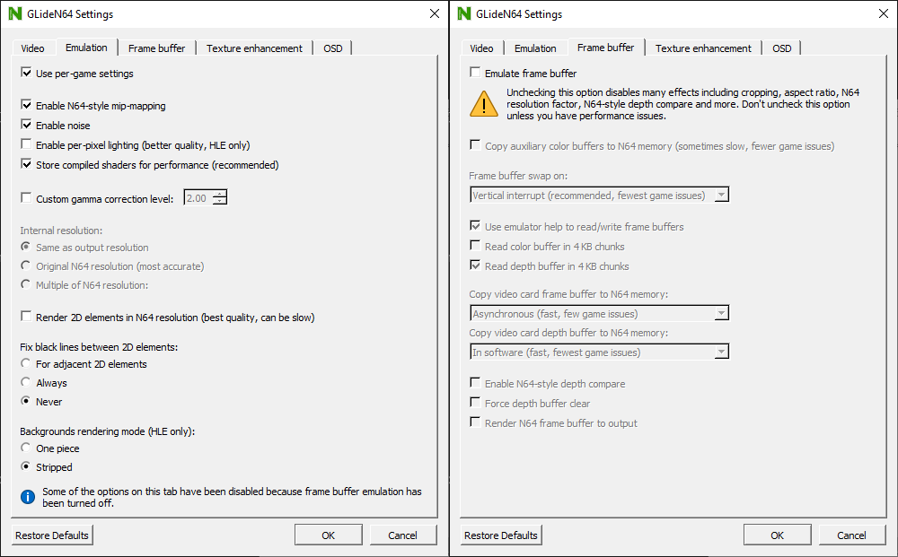

# LINK's GLideN64

Arguably the best HLE graphics plugin available. This is a fork based on GLideN64 4.0, introducing some regressions that improve romhack compatibility. This version of the plugin also allows for aspect ratio correction with framebuffer disabled. 720p resolution is recommended to avoid framebuffer artifacts.

!!!warning
Make sure to **disable** framebuffer emulation, since it increases latency.
!!!

!!!warning
If using OBS, make sure to use the **Game Capture** source.
!!!

[!ref Return to plugin selection](plugin_setup.md#plugin-selection)
