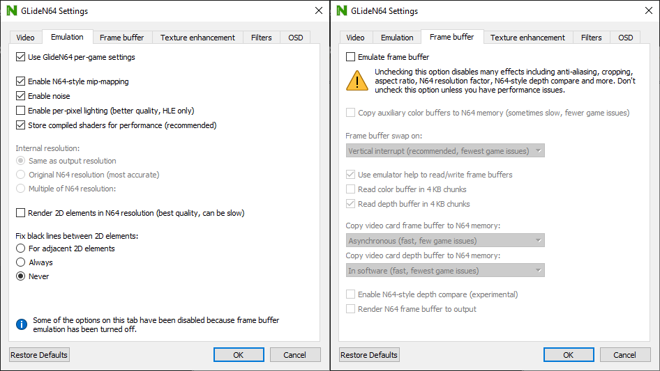

# GlideN64 rev. 8004dc2

An older version of GLideN64. Compared to newer versions it’s missing some features (such as aspect ratio correction with framebuffer disabled), however it has good compatibility with romhacks and is less resource intensive. 720p resolution is recommended to reduce framebuffer artifacts.

!!!warning
Make sure to **disable** framebuffer emulation, since it increases latency.
!!!

!!!warning
If using OBS, make sure to use the **Game Capture** source.
!!!

[!ref Return to plugin selection](plugin_setup.md#plugin-selection)
