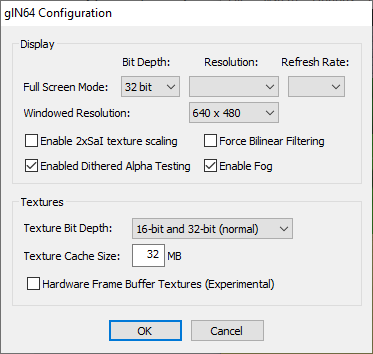

# glN64 0.4.1

[!file Download (manual setup only)](https://www.dropbox.com/s/a15svm4daaqe51g/glN64_v0.4.1.zip?dl=1)

An older plugin that still works great for Super Mario 64, while having lower requirements. Use this if you have an older PC and GLideN64 doesn’t work for you.

!!!
Make sure to check **Enabled Dithered Alpha Testing** to fix the dissolve effect (appearing during warps or with Vanish Cap).
!!!

[!ref Return to plugin selection](plugin_setup.md#plugin-selection)
