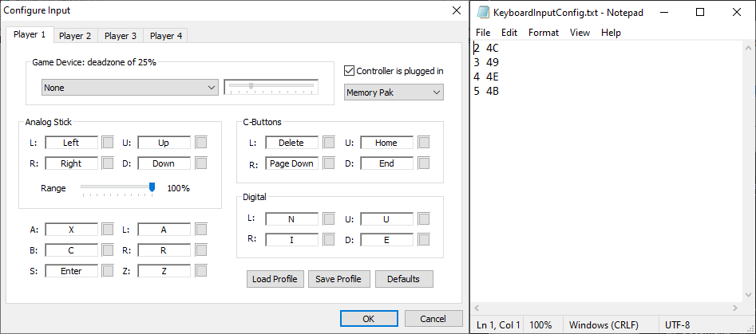

# LINK's DirectInput7 1.6.1

This is a modification of Jabo’s DirectInput meant for **keyboard** players, which adds support for analog modifiers (so you can e.g. walk instead of running). The modifiers are configured through the **KeyboardInputConfig.txt** file, which specifies the **amount by which the analog values get divided** next to corresponding **virtual-key codes**, which specify the buttons triggering the modifiers. 

!!!
A full list of virtual-key codes can be found here: [https://docs.microsoft.com/en-gb/windows/win32/inputdev/virtual-key-codes](https://docs.microsoft.com/en-gb/windows/win32/inputdev/virtual-key-codes)
!!!

For example, the first line of the default config file is `2 4C`, which means the analog inputs will get halved when the L key is held. The plugin will only read **5 lines** of the config, so you will likely have to replace the existing binds.

An additional video explanation can be found here:

[!embed](https://www.youtube.com/embed/pwsz8ak65N0?start=142)
