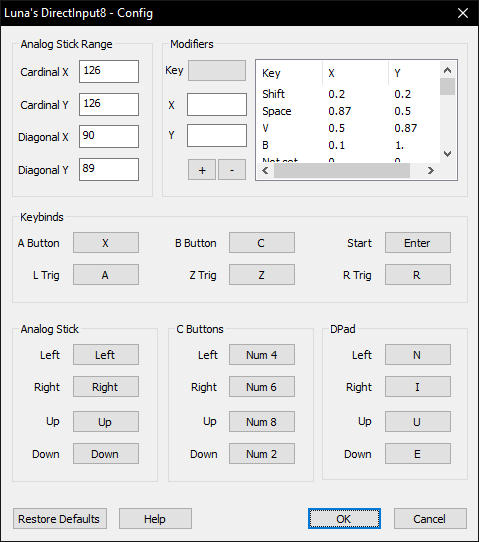

# Luna's DirectInput8

[!ref target="blank" text="Download (manual setup only)"](https://github.com/LunaticShiN3/Luna-DirectInput8/releases)

!!!
This plugin only works with keyboard. For controllers, use an appropriate alternative listed in the [plugin selection page](plugin_setup.md#plugin-selection).
!!!

!!!
Detailed usage instructions can be found on the plugin author's page: [https://sites.google.com/view/shurislibrary/luna-dinput8](https://sites.google.com/view/shurislibrary/luna-dinput8)
!!!

This is an input plugin designed for **keyboard** players, made to work around issues of other plugins. Has a remapping GUI with a fairly flexible analog modifier functionality (which allow you to e.g. walk instead of running, or hold a specific angle).

[!ref Return to plugin selection](plugin_setup.md#plugin-selection)
