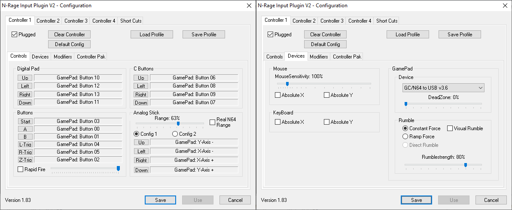
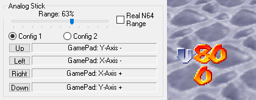
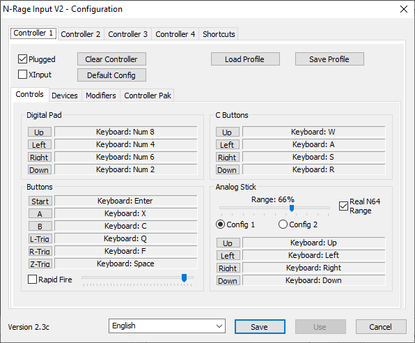

# N-Rage's Direct-Input8 V2 1.83

[!file Download (manual setup only)](https://www.dropbox.com/s/31fdrxuxjybzzu0/nrplugin2_183.zip?dl=1)

!!!
Before trying to set up the binds, go to the **Devices** tab and select your controller in the device dropdown.
!!!

An older plugin with a plethora of features. An excellent choice for DirectInput controllers, but may have issues with handling XInput. Make sure that **Plugged** is checked. Set deadzone to the lowest amount that doesn’t give you issues (e.g. Mario walking on his own), usually 0% is sufficient as SM64 has a deadzone of its own.

### Setting the range

To determine the optimal analog stick range, one may want to use the numerical input display feature present in Usamune ROM. To enable, launch the rom, then press **D-Pad down** to bring out the configuration menu. Navigate to the **HUD** section, then set the **INPUT** option to **ONNUM** using the C-Buttons. This should make two numbers appear in the bottom left corner of the game, the first one being Y axis value and the other one being X axis. Adjust the **Range** slider in N-Rage settings until you’re hitting **about 80** in-game while holding main directions. This is what the original N64 controller range’s like and what N64 games expect, anything more will result in excessive sensitivity. If you’re struggling to reach those values even with range set to 100%, try calibrating your controller in Windows.

!!!warning
The **Real N64 Range** option should be **unchecked** at all times, as it reduces range on diagonal angles.
!!!

## N-Rage Input Plugin V2 2.3c

[!file Download (manual setup only)](https://www.dropbox.com/s/o92omr2tg7i0gyj/NRage_Input_V2.3d.zip?dl=1)

Usage mostly similar to the older version, aside from missing device selection. Use this if you have any problems with 1.83.

!!!warning
Avoid using in XInput mode - its code is poorly stitched on top of the rest of the plugin, which results in e.g. macros not working. It also doesn’t handle reconnecting controllers properly and the analog range is far too sensitive. If you have an XInput controller, [**Octomino's SDL Input**](octomino.md) should be used instead.
!!!

[!ref Return to plugin selection](plugin_setup.md#plugin-selection)
