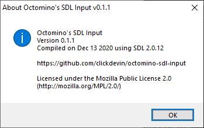
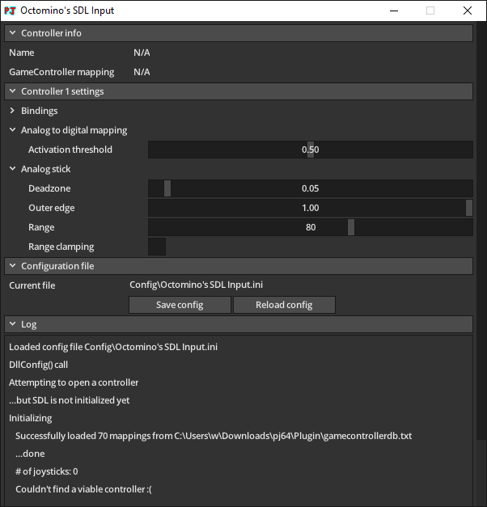

# Octomino's SDL Input v0.1.1

[!file Download (manual setup only)](https://github.com/clickdevin/octomino-sdl-input/releases/download/v0.1.1/octomino-sdl-input-0.1.1.zip)

A simple plugin based on the SDL2 library. Has plug and play support for controllers such as Xbox, PS4/5, Switch Pro and many others through the provided [controller database](https://github.com/gabomdq/SDL_GameControllerDB). Plug and play, no configuration needed.

## wermi's fork

[!ref target="blank" text="Download (manual setup only)"](https://github.com/wermipls/octomino-sdl-input/releases)

While the original project doesn't have configuration and hasn't been updated in a while, there's a fork which provides rudimentary configuration support, including controls rebinding. Use this if you're not happy with the defaults.

!!!warning
The plugin is still work in progress and may have bugs. If you encounter a problem, [create an issue on GitHub](https://github.com/wermipls/octomino-sdl-input/issues).
!!!

[!ref Return to plugin selection](plugin_setup.md#plugin-selection)
