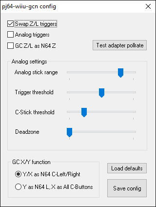
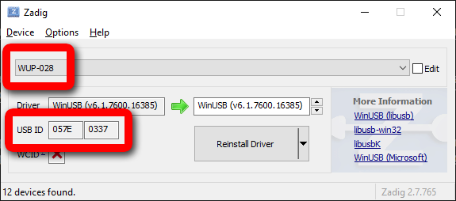

# pj64-wiiu-gcn

[!ref target="blank" text="Download"](https://github.com/wermipls/pj64-wiiu-gcn/releases/latest/download/pj64-wiiu-gcn.dll)

!!!
Please report any problems on [GitHub](https://github.com/wermipls/pj64-wiiu-gcn/issues). Make sure to include a log file, placed in `Logs/pj64-wiiu-gcn.txt`.
!!!

An input plugin with native support for the Wii U/Switch Gamecube adapter (and clones in Wii U mode). Make sure that any programs using the adapter (such as Dolphin, Yuzu or GCNUSBFeeder) are closed. Before starting the emulator, make sure your controller is plugged into the **first port** on the adapter. If you didn't install the **WinUSB driver** through **Zadig** yet, see next section.

## WinUSB driver install

Before using the plugin, you'll need to have the WinUSB driver installed. To do so, download and run Zadig from the official website:

[!ref target="blank" text="Zadig (official page)"](http://zadig.akeo.ie/)

After running, you should get a window similar to the one pictured below. Go to **Options** and check **List All Devices**. In the devices dropdown, select **WUP-028**.

!!!danger
**DO NOT** attempt to install the driver if the device does not match up! The **USB ID** field should have `057E 0337` in it, like on the screenshot below. If you have a third party adapter, make sure it's set to Wii U mode.
!!!

[!ref Return to plugin selection](plugin_setup.md#plugin-selection)
