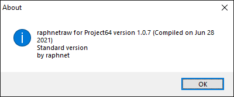

# raphnetraw for Project64

A plugin for **third generation raphnet N64 to USB** adapters, allowing direct communication with the controller. Has low latency and provides 100% accurate inputs to console. No configuration possible (or needed).

!!!
It is suggested to use the **port 1 only** version for optimal performance.
!!!

!!!
If you have the dual-port version of the adapter, there is a fork that makes it possible to switch between N64 controllers by pressing Z+L+R: https://github.com/panther03/pj64raphnetraw/releases 
!!!
