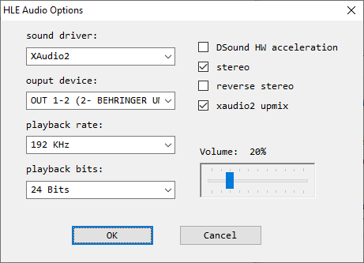

# shunyuan’s HLE audio plugin v1.8.2u1

[!file Download (manual setup only)](https://www.dropbox.com/s/hhgnnm77a3945j7/HleAudio_v1.8.2u1.zip?dl=1)

Another good audio plugin, however it has higher latency than Azimer and doesn’t allow going above the FPS limit. Unlimits FPS during the load screens, so it may cause runs to be invalid if **Frame Limiter** is not enabled.

[!ref Return to plugin selection](plugin_setup.md#plugin-selection)
