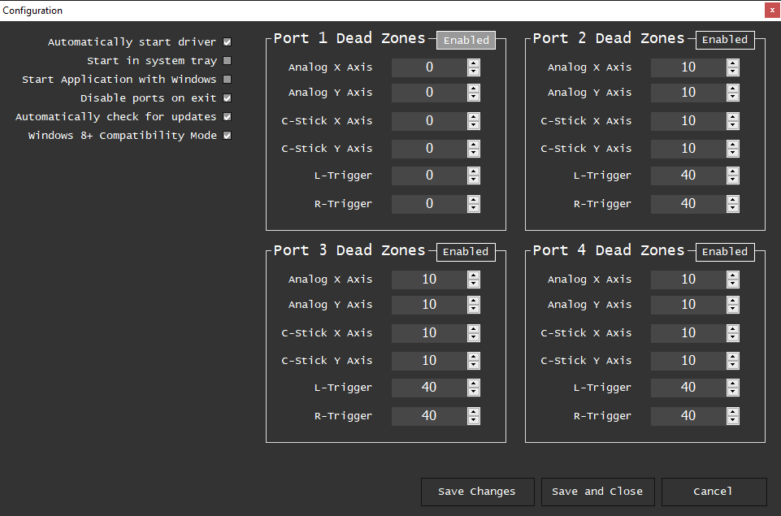

# Wii U/Switch Gamecube adapter setup

Unlike Yuzu or Dolphin, there is no native support for the Wii U adapter for Project64. It's necessary to install drivers which will make the adapter act like a standard DirectInput controller.

!!!warning
There have been reports of the drivers having problems with some third party adapters. If you don't have the official Nintendo adapter or the Mayflash adapter, proceed with caution.
!!!

!!!warning
If you are using **Windows 11**, you might not be able to install vJoy. See https://github.com/shauleiz/vJoy/issues/57 for details.
!!!

## Installing Massive's drivers

Detailed instructions on the installation process can be found below. 

[!ref target="blank" text="Massive's website"](http://m4sv.com/page/wii-u-gcn-usb-driver)

## Additional driver config

After installing the drivers, it's a good idea to change a couple of settings. In the adapter application, click on the **Configure** button. By default, all four ports are enabled - you might want to **disable** the unused ones to avoid cluttering your device list. Set the **analog stick deadzones** to **0** (you'll be able to adjust the deadzone in Project64 later on). Check **Disable ports on exit** to disable vJoy devices after you're done using the drivers. After you're done, click on **Save and Close**.

## Controller calibration

Some Gamecube controllers come with analog stick offset out of the factory. Unfortunately, Massive's drivers don't calibrate the stick centers, like a real console would do. To compensate for this, you can callibrate the controller in Windows. In the adapter window, click on **Windows Gamepad Info**, then double click on **vJoy Device**. Go to the **Settings** tab and click on the **Calibrate** button. Follow the instructions in the calibration wizard. After finishing, your stick should be properly centered.

## Project64 setup

Use **N-Rage's Direct-Input8 V2 1.83** for the controller plugin. For convenience, GiBoss has created a preconfigured profile with all the binds already set up. Download the profile, then load it by clicking on the **Load Profile** button. 

[!file Preconfigured N-Rage profile](https://cdn.discordapp.com/attachments/122115767129866240/442343226335297546/gc.cpf)

!!!
After loading the profile, make sure to select **vJoy Device** in the **Devices** tab, as well as uncheck **Real N64 Range**.
!!!

Additional information on how to use N-Rage can be found on its own page, linked below.

[!ref N-Rage's Input plugin](nrage.md)